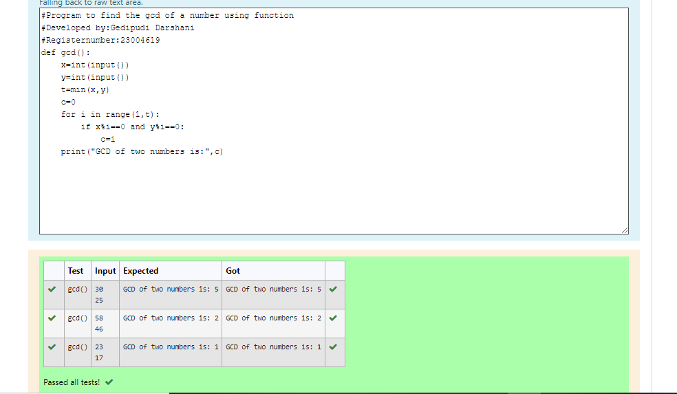

# Find the GCD of two numbers

## AIM:
To write a program to find the GCD of two numbers using function.

## Equipments Required:
1. Hardware – PCs
2. Anaconda – Python 3.7 Installation / Moodle-Code Runner

## Algorithm
1. Define a function.
2. Get the two numbers from the user.
3. Compare the two values, to find the smaller number.
4. Use for() and if() loop to find the GCD of the two numbers.

## Program:
```
/*
Program to find the gcd of two number using function.
Developed by: Gedipudi Darshani
RegisterNumber:  23004619
def gcd():
    x=int(input())
    y=int(input())
    t=min(x,y)
    c=0
    for i in range(1,t):
        if x%i==0 and y%i==0:
            c=i
    print("GCD of two numbers is:",c)
*/
```

## Output:
 

## Result:
Thus the program to find the GCD of two numbers is written and verified using python programming.
